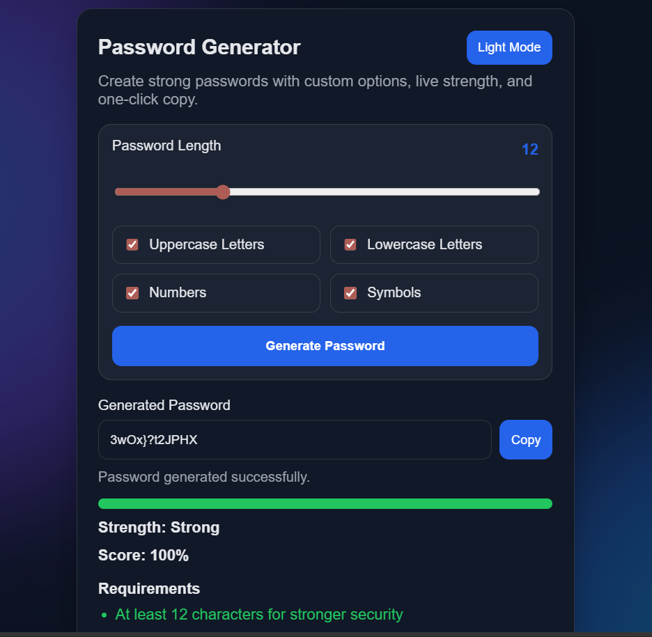

# Password Generator

A modern and responsive password generator web application built using **HTML**, **CSS**, and **Vanilla JavaScript**.

This project helps users create strong and secure passwords instantly. It allows users to customize password length and character types, then generates a random password based on the selected options. The application also provides a live strength meter, a security checklist, and helpful suggestions so the generated password is not only random but also easy to evaluate.

---

## Table of Contents

- [Overview](#overview)
- [Features](#features)
- [Why This Project Is Useful](#why-this-project-is-useful)
- [Tech Stack](#tech-stack)
- [Project Structure](#project-structure)
- [How It Works](#how-it-works)
- [How To Run The Project](#how-to-run-the-project)
- [How To Use The Project](#how-to-use-the-project)
- [Password Rules Checked](#password-rules-checked)
- [Customization Options](#customization-options)
- [Responsive Design](#responsive-design)
- [GitHub Upload Steps](#github-upload-steps)
- [Future Improvements](#future-improvements)
- [Author](#author)

---

## Overview

The **Password Generator** is a frontend project designed to create secure passwords in a simple and user-friendly way.

Instead of manually thinking of a password, the user can:

- Set the password length
- Choose whether to include uppercase letters
- Choose whether to include lowercase letters
- Choose whether to include numbers
- Choose whether to include symbols

Once the password is generated, the app immediately analyzes it and shows:

- Password strength level
- Percentage score
- Security rule status
- Suggestions for improvement

This makes the project useful for both learning frontend development and demonstrating a practical cybersecurity-related mini application.

---

## Features

- Generate secure random passwords instantly
- Select password length from **6 to 32** characters
- Enable or disable:
  - Uppercase letters
  - Lowercase letters
  - Numbers
  - Symbols
- Live password strength meter
- Percentage-based strength score
- Password quality suggestions
- Rule-by-rule password validation
- One-click copy to clipboard
- Dark mode and light mode toggle
- Clean and responsive user interface
- Works directly in the browser without any library or framework

---

## Why This Project Is Useful

This project is useful because:

- It solves a real-world problem of creating strong passwords
- It demonstrates DOM manipulation in JavaScript
- It shows how to work with form inputs, events, and dynamic UI updates
- It is beginner-friendly and easy to understand
- It is a good portfolio project for GitHub

If you want to upload a simple but practical project to GitHub, this is a strong option because it is visually appealing and functionally useful.

---

## Tech Stack

The project is built using the following technologies:

- **HTML5** for page structure
- **CSS3** for styling, layout, themes, and responsiveness
- **JavaScript (ES6)** for password generation logic and interactivity

No external packages, frameworks, or build tools are required.

---

## Project Structure

```text
password_generator/
├── index.html   # Main structure of the application
├── style.css    # Complete styling, themes, and responsive layout
├── script.js    # Password generation logic and UI functionality
└── README.md    # Project documentation
```
## Project Screenshot



---

## How It Works

The application works in a simple flow:

1. The user selects the desired password length using the range slider.
2. The user selects one or more character types.
3. When the user clicks the **Generate Password** button, the app creates a random password.
4. The generated password is displayed in the output field.
5. The app checks password quality and updates:
   - Strength label
   - Score percentage
   - Rules checklist
   - Suggestions section
6. The user can copy the password using the **Copy** button.

This process happens instantly in the browser.

---

## How To Run The Project

You can run this project very easily on your local machine.

### Method 1: Run Directly

1. Download or clone the project.
2. Open the project folder.
3. Open `index.html` in your browser.

That is all. No setup is needed.

### Method 2: Using VS Code Live Server

If you use VS Code, you can also run the project using the **Live Server** extension:

1. Open the folder in VS Code.
2. Right-click on `index.html`.
3. Click **Open with Live Server**.

---

## How To Use The Project

Follow these steps:

1. Open the app in your browser.
2. Use the slider to set the password length.
3. Select the character types you want in the password.
4. Click **Generate Password**.
5. Check the generated password in the input box.
6. Review the strength meter and suggestions.
7. Click **Copy** to copy the password to your clipboard.
8. Use the **Light Mode / Dark Mode** button to switch the theme.

---

## Password Rules Checked

After generating the password, the application checks the following security conditions:

1. Password should be at least **12 characters** long for stronger security
2. Password should contain at least one uppercase letter
3. Password should contain at least one lowercase letter
4. Password should contain at least one number
5. Password should contain at least one special character

Based on these checks, the app displays:

- **Weak** password
- **Medium** password
- **Strong** password

---

## Customization Options

The user can customize the generated password through the following settings:

- **Length Slider**  
  Allows choosing password length from 6 to 32 characters.

- **Uppercase Letters**  
  Includes characters like `A-Z`.

- **Lowercase Letters**  
  Includes characters like `a-z`.

- **Numbers**  
  Includes digits like `0-9`.

- **Symbols**  
  Includes special characters like `! @ # $ % ^ & *`.

These options make the generator flexible and practical for different use cases.

---

## Responsive Design

The UI is designed to work properly on:

- Desktop
- Laptop
- Tablet
- Mobile devices

The layout adjusts automatically on smaller screens so the project remains easy to use across devices.

---

## GitHub Upload Steps

If you want to upload this project to GitHub, use the following commands in the terminal:

```bash
git init
git add .
git commit -m "Add password generator project"
git branch -M main
git remote add origin https://github.com/pawan-kr-pandit/password-generator.git
git push -u origin main
```

Replace:

- `pawan-kr-pandit` as your GitHub username
- `password-generator` as your repository name

Example:

```bash
git remote add origin https://github.com/pawan-kr-pandit/password-generator.git
```

---

## Future Improvements

This project can be improved further by adding:

- Password history section
- Copy success toast notification
- Advanced entropy calculation
- Option to exclude similar characters like `O` and `0`
- Option to exclude ambiguous symbols
- Save theme preference in local storage
- Multiple language support
- Password breach check using an API

---

## Author

**Pawan Kr. Pandit**

- GitHub: [pawan-kr-pandit](https://github.com/pawan-kr-pandit)

---

If you found this project useful, you can upload it to GitHub and include screenshots to make your repository look even better.
